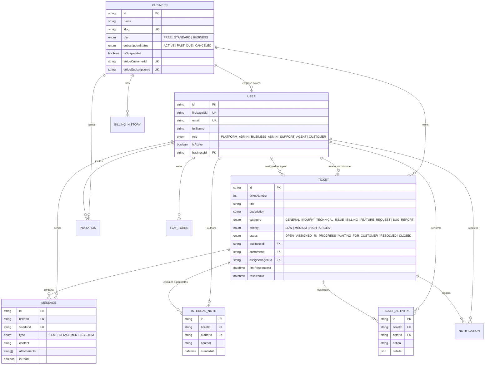

# SupportFlow Entity-Relationship (ER) Diagram

```mermaid
erDiagram
    BUSINESS ||--o{ USER : "employs / owns"
    BUSINESS ||--o{ TICKET : "owns"
    BUSINESS ||--o{ INVITATION : "issues"
    BUSINESS ||--o{ BILLING_HISTORY : "has"
    
    USER ||--o{ TICKET : "creates as customer"
    USER ||--o{ TICKET : "assigned as agent"
    USER ||--o{ MESSAGE : "sends"
    USER ||--o{ INTERNAL_NOTE : "authors"
    USER ||--o{ TICKET_ACTIVITY : "performs"
    USER ||--o{ FCM_TOKEN : "owns"
    USER ||--o{ NOTIFICATION : "receives"
    USER ||--o{ INVITATION : "invites"

    TICKET ||--o{ MESSAGE : "contains"
    TICKET ||--o{ INTERNAL_NOTE : "contains agent notes"
    TICKET ||--o{ TICKET_ACTIVITY : "logs history"
    TICKET ||--o{ NOTIFICATION : "triggers"

    USER {
        string id PK
        string firebaseUid UK
        string email UK
        string fullName
        enum role "PLATFORM_ADMIN | BUSINESS_ADMIN | SUPPORT_AGENT | CUSTOMER"
        boolean isActive
        string businessId FK
    }

    BUSINESS {
        string id PK
        string name
        string slug UK
        enum plan "FREE | STANDARD | BUSINESS"
        enum subscriptionStatus "ACTIVE | PAST_DUE | CANCELED"
        boolean isSuspended
        string stripeCustomerId UK
        string stripeSubscriptionId UK
    }

    TICKET {
        string id PK
        int ticketNumber
        string title
        string description
        enum category "GENERAL_INQUIRY | TECHNICAL_ISSUE | BILLING | FEATURE_REQUEST | BUG_REPORT"
        enum priority "LOW | MEDIUM | HIGH | URGENT"
        enum status "OPEN | ASSIGNED | IN_PROGRESS | WAITING_FOR_CUSTOMER | RESOLVED | CLOSED"
        string businessId FK
        string customerId FK
        string assignedAgentId FK
        datetime firstResponseAt
        datetime resolvedAt
    }

    MESSAGE {
        string id PK
        string ticketId FK
        string senderId FK
        enum type "TEXT | ATTACHMENT | SYSTEM"
        string content
        string[] attachments
        boolean isRead
    }

    INTERNAL_NOTE {
        string id PK
        string ticketId FK
        string authorId FK
        string content
        datetime createdAt
    }

    TICKET_ACTIVITY {
        string id PK
        string ticketId FK
        string actorId FK
        string action
        json details
    }
```
