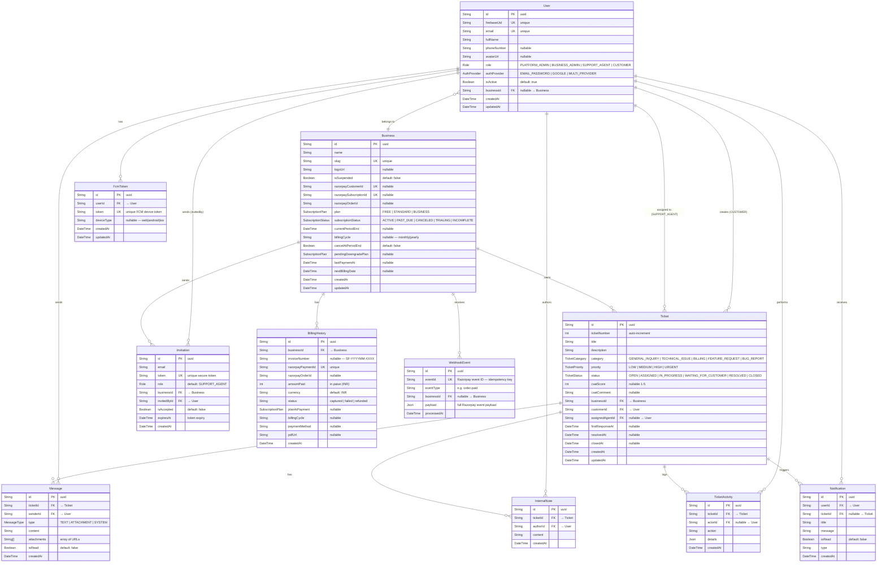

# 🗄️ SupportFlow — Entity Relationship (ER) Diagram

> Generated from `backend/prisma/schema.prisma` — the single source of truth for the database.

---

## 📊 ER Diagram (Mermaid)



---

## 📋 Table Summary

| Table | Rows Description | Key Relationships |
|-------|-----------------|-------------------|
| `User` | All users across all roles | Belongs to Business, creates/assigned Tickets |
| `Business` | Multi-tenant business accounts | Owns Tickets, Invitations, BillingHistory |
| `Ticket` | Customer support tickets | Belongs to Business + Customer, optional Agent |
| `Message` | Real-time chat messages in tickets | Belongs to Ticket + Sender |
| `InternalNote` | Agent-only notes (hidden from customers) | Belongs to Ticket + Author |
| `TicketActivity` | Audit trail of ticket events | Belongs to Ticket + Actor |
| `Notification` | In-app notifications | Belongs to User + optional Ticket |
| `FcmToken` | Firebase push notification device tokens | Belongs to User |
| `Invitation` | Pending agent invitations (with expiry) | Belongs to Business + InvitedBy |
| `BillingHistory` | Payment invoice records | Belongs to Business |
| `WebhookEvent` | Idempotency store for Razorpay webhooks | Optionally linked to Business |

---

## 🔑 Enums

### `Role`
| Value | Description |
|-------|-------------|
| `PLATFORM_ADMIN` | Global platform administrator |
| `BUSINESS_ADMIN` | Owner/admin of a business |
| `SUPPORT_AGENT` | Support team member |
| `CUSTOMER` | End user who creates tickets |

### `SubscriptionPlan`
| Value | Agents | Tickets/mo | Monthly Price |
|-------|--------|-----------|---------------|
| `FREE` | 1 | 25 | ₹0 |
| `STANDARD` | 5 | Unlimited | ₹2,499 |
| `BUSINESS` | 20 | Unlimited | ₹6,499 |

### `SubscriptionStatus`
`ACTIVE` | `PAST_DUE` | `CANCELED` | `TRIALING` | `INCOMPLETE`

### `TicketStatus`
`OPEN` → `ASSIGNED` → `IN_PROGRESS` → `WAITING_FOR_CUSTOMER` → `RESOLVED` → `CLOSED`

### `TicketPriority`
`LOW` | `MEDIUM` | `HIGH` | `URGENT`

### `TicketCategory`
`GENERAL_INQUIRY` | `TECHNICAL_ISSUE` | `BILLING` | `FEATURE_REQUEST` | `BUG_REPORT`

### `MessageType`
`TEXT` | `ATTACHMENT` | `SYSTEM`

### `AuthProvider`
`EMAIL_PASSWORD` | `GOOGLE` | `MULTI_PROVIDER`

---

## 📍 Key Indexes

| Table | Index | Purpose |
|-------|-------|---------|
| `User` | `(firebaseUid)` | Token verification on every request |
| `User` | `(businessId, role)` | Filter agents/admins per business |
| `User` | `(role, isActive)` | Active agent count for plan limits |
| `Business` | `(plan, subscriptionStatus)` | Subscription management queries |
| `Business` | `(isSuspended)` | Suspension check |
| `Business` | `(currentPeriodEnd)` | Expiry cron job |
| `Ticket` | `(businessId, status)` | Business admin ticket listing |
| `Ticket` | `(businessId, createdAt)` | Dashboard date-range queries |
| `Ticket` | `(customerId, status)` | Customer's own ticket listing |
| `Ticket` | `(assignedAgentId, status)` | Agent's assigned ticket listing |
| `Message` | `(ticketId, createdAt)` | Chronological chat history |
| `Notification` | `(userId, isRead)` | Unread notification count |
| `Notification` | `(userId, createdAt)` | User notification list |
| `Invitation` | `(businessId, isAccepted)` | Pending invites per business |
| `BillingHistory` | `(businessId, createdAt)` | Billing history listing |
| `WebhookEvent` | `(eventId)` | Idempotency duplicate check |

---

## 🛠️ Useful Prisma Commands

```bash
# Open Prisma Studio (visual ER browser)
cd backend && npx prisma studio

# Generate DB diagram image (requires prisma-erd-generator)
npx prisma generate

# View current migration status
npx prisma migrate status

# Create a new migration after schema changes
npx prisma migrate dev --name describe_your_change

# Deploy migrations to production
npx prisma migrate deploy
```
